# Home SOC Lab — Despliegue de Wazuh y detección de autenticaciones fallidas

> Laboratorio doméstico de operaciones de seguridad: despliegue de un SIEM real (Wazuh), monitorización de un endpoint Windows y detección, triaje e investigación de un ataque de fuerza bruta contra credenciales.

*Home SOC lab: Wazuh SIEM deployed on Ubuntu Server, monitoring a Windows 10 endpoint via the
Wazuh agent. Covers detection, triage and MITRE ATT&CK mapping of a brute force authentication
attack, plus a CIS benchmark configuration assessment of the endpoint.*

---

## Índice

- [Objetivo](#objetivo)
- [Arquitectura](#arquitectura)
- [Entorno](#entorno)
- [Despliegue del servidor Wazuh](#despliegue-del-servidor-wazuh)
- [Enrolado del agente Windows](#enrolado-del-agente-windows)
- [Caso práctico: detección de fuerza bruta](#caso-práctico-detección-de-fuerza-bruta)
- [Hallazgos adicionales](#hallazgos-adicionales)
- [Problemas encontrados](#problemas-encontrados)
- [Conclusiones](#conclusiones)
- [Evolución del laboratorio](#evolución-del-laboratorio)
- [Referencias](#referencias)

---

## Objetivo

Montar desde cero un entorno de monitorización de seguridad equivalente al que opera un analista SOC de nivel 1, con tres metas concretas:

- Desplegar y configurar un SIEM real, no un entorno simulado ni una plataforma de formación.
- Monitorizar un endpoint Windows mediante agente y verificar la recolección de eventos.
- Generar actividad maliciosa de forma controlada, detectarla, y completar el ciclo de triaje: análisis, clasificación MITRE ATT&CK y propuesta de mitigación.

---

## Arquitectura

```text
┌──────────────────────┐        agente Wazuh        ┌───────────────────────────┐
│   Endpoint Windows   │ ─────────────────────────► │      Servidor Wazuh       │
│   win10-ws01         │      puertos 1514/1515     │  Manager + Indexer +      │
│   192.168.10.246     │                            │  Dashboard (all-in-one)   │
└──────────────────────┘                            │  192.168.10.160           │
                                                    └───────────────────────────┘
                                                                  ▲
                                                                  │ HTTPS (443)
                                                        ┌─────────┴─────────┐
                                                        │  Equipo anfitrión │
                                                        │    (navegador)    │
                                                        └───────────────────┘
```

**Flujo de datos:** el agente instalado en el endpoint recoge los eventos del canal de seguridad de Windows y los envía al **manager**, que los analiza contra su conjunto de reglas y genera alertas. El **indexer** (OpenSearch) las almacena e indexa, y el **dashboard** es la interfaz donde el analista consulta e investiga.

---

## Entorno

| Componente       | Detalle                                                                                                                                                |
| ---------------- | ------------------------------------------------------------------------------------------------------------------------------------------------------ |
| Hipervisor       | VirtualBox **7.1.10 r169112**                                                                                                                          |
| VM servidor      | Ubuntu Server **24.04.5 LTS** (noble) — 8 GB RAM / 4 vCPU / disco 50 GB                                                                                |
| VM endpoint      | Windows 10 — 4 GB RAM / 2 vCPU / disco 50 GB                                                                                                           |
| Modo de red      | **Adaptador puente** — ambas VMs obtienen IP de la red local, se ven entre sí y son accesibles desde el navegador del anfitrión sin reenvío de puertos |
| Versión de Wazuh | **4.14.7** (despliegue all-in-one)                                                                                                                     |
| IP servidor      | 192.168.10.160                                                                                                                                         |
| IP endpoint      | 192.168.10.246                                                                                                                                         |

**Decisiones de diseño y su justificación:**

- **Ubuntu Server en lugar de Desktop.** El dashboard de Wazuh se consulta desde el navegador del equipo anfitrión, por lo que un entorno gráfico en la VM solo consumiría RAM y CPU sin aportar funcionalidad. Los servidores en producción se despliegan sin escritorio.
- **Versión 24.04 LTS y no la más reciente.** En el momento del despliegue, Ubuntu 26.04 LTS ya estaba disponible, pero la documentación oficial de Wazuh 4.14 solo lista soporte hasta 24.04. Se priorizó la compatibilidad soportada frente a la novedad.
- **Adaptador puente frente a NAT.** Necesitaba comunicación bidireccional entre ambas VMs y acceso al dashboard desde el anfitrión. El modo puente lo resuelve sin configurar reenvío de puertos.

---

## Despliegue del servidor Wazuh

### Instalación

Se utiliza el asistente de instalación *all-in-one*, que despliega los tres componentes centrales (manager, indexer y dashboard) en el mismo host y genera automáticamente los certificados y las credenciales de acceso:

```bash
curl -sO https://packages.wazuh.com/4.14/wazuh-install.sh
sudo bash ./wazuh-install.sh -a
```

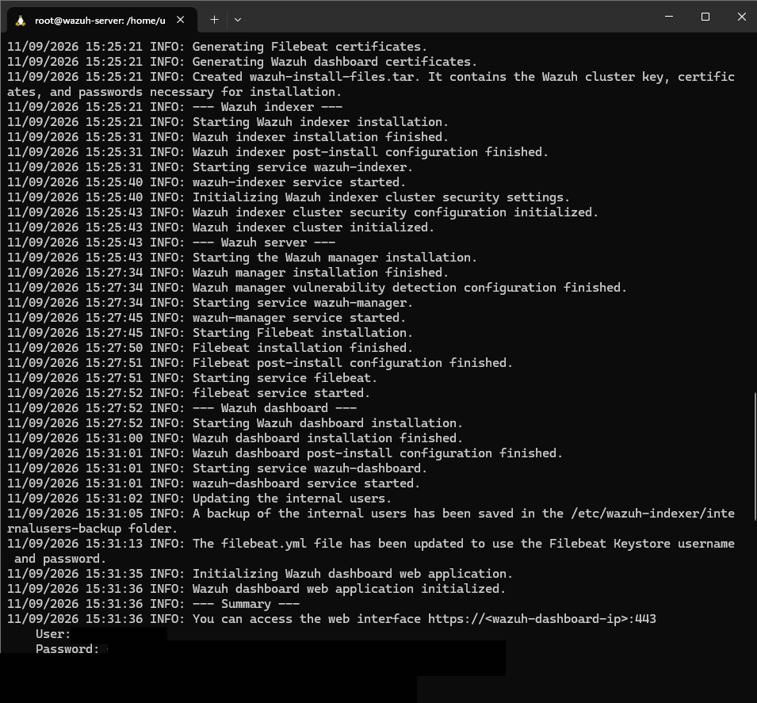

El instalador imprime al finalizar la URL de acceso y las credenciales del usuario `admin`. Si se pierden, se recuperan desde el fichero generado durante la instalación:

```bash
sudo tar -xvf wazuh-install-files.tar
cat wazuh-install-files/wazuh-passwords.txt
```

### Verificación de servicios

```bash
systemctl status wazuh-manager wazuh-indexer wazuh-dashboard filebeat --no-pager
```

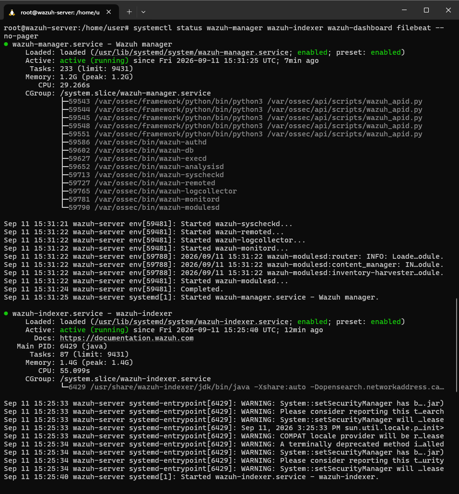

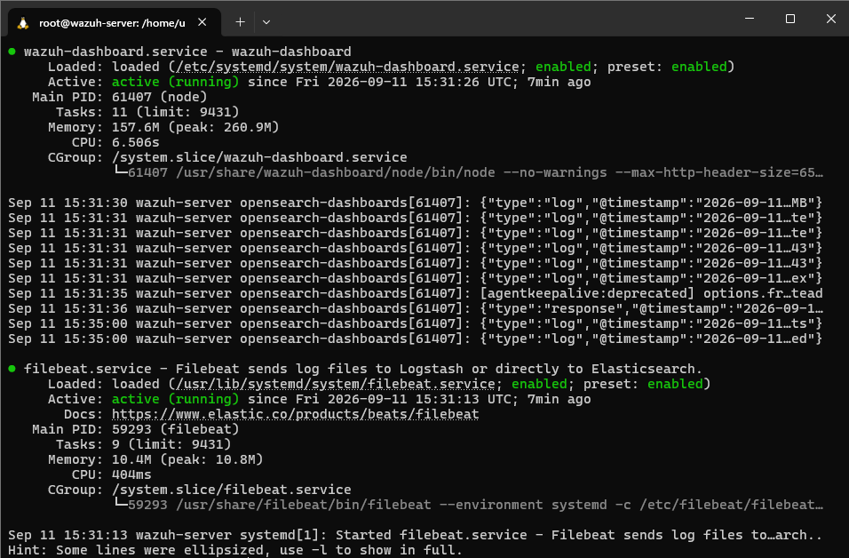

Los cuatro servicios deben aparecer como `active (running)`. El manager levanta sus daemons internos —`wazuh-analysisd`, `wazuh-remoted`, `wazuh-authd`, `wazuh-syscheckd`, `wazuh-logcollector`, `wazuh-modulesd`— y el consumo total del stack se sitúa en torno a 2,8 GB de RAM.

### Acceso al dashboard

El dashboard queda accesible en `https://192.168.10.160` desde el navegador del equipo anfitrión.

El navegador muestra una advertencia de certificado no confiable: es el comportamiento esperado, ya que el instalador genera **certificados autofirmados** en lugar de certificados emitidos por una autoridad certificadora reconocida. En un entorno de producción se sustituirían por certificados válidos emitidos por una CA de confianza.

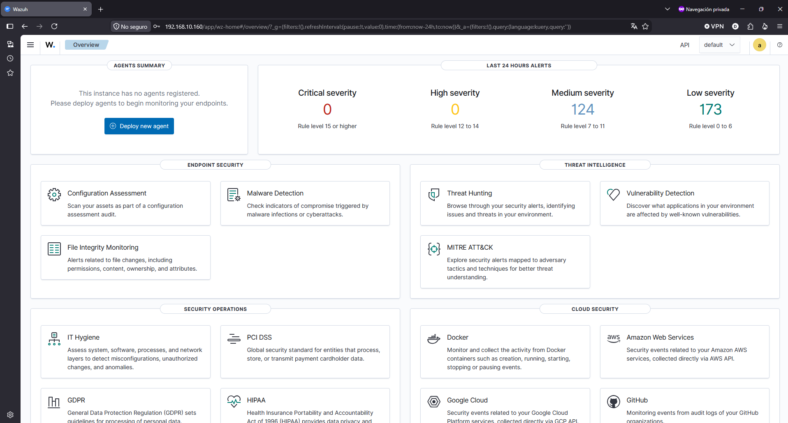

---

## Enrolado del agente Windows

Desde el dashboard, en **Agents → Deploy new agent**, se selecciona Windows como sistema operativo, se indica la dirección IP del servidor y se asigna el nombre del agente siguiendo una convención `sistema-rol-número` (`win10-ws01`), pensada para que el nombre identifique la máquina cuando el laboratorio crezca.

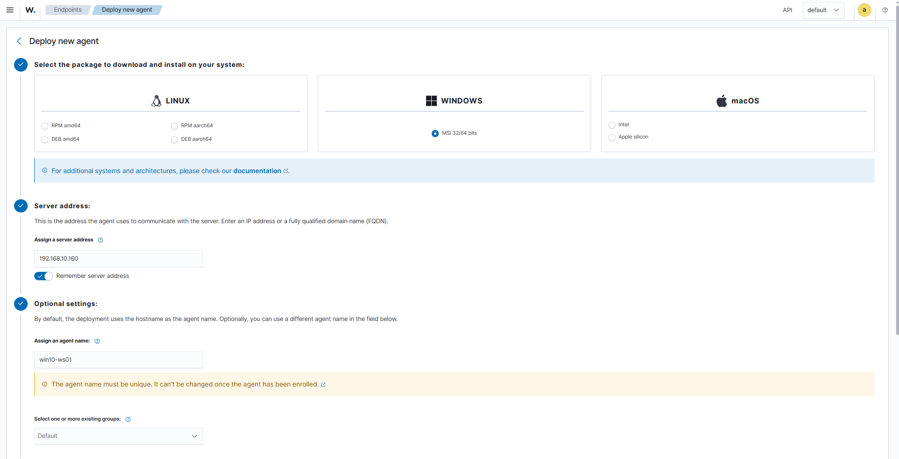

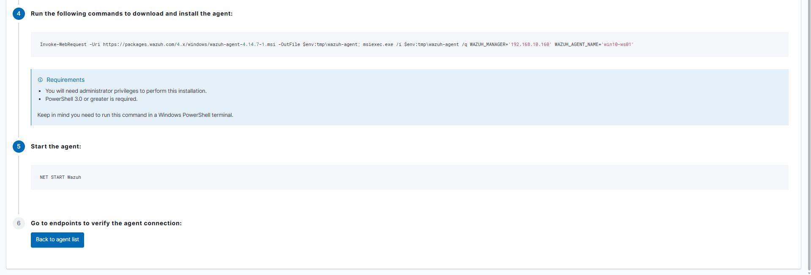

El dashboard genera el comando de despliegue, que se ejecuta en PowerShell con privilegios de administrador en el endpoint:

```powershell
Invoke-WebRequest -Uri https://packages.wazuh.com/4.x/windows/wazuh-agent-4.14.7-1.msi `
  -OutFile $env:tmp\wazuh-agent
msiexec.exe /i $env:tmp\wazuh-agent /q WAZUH_MANAGER='192.168.10.160' WAZUH_AGENT_NAME='win10-ws01'
```

El parámetro `/q` ejecuta la instalación en modo silencioso: no muestra ninguna ventana ni progreso, por lo que conviene esperar unos segundos antes de comprobar el resultado.

```powershell
NET START WazuhSvc
Get-Service WazuhSvc
```

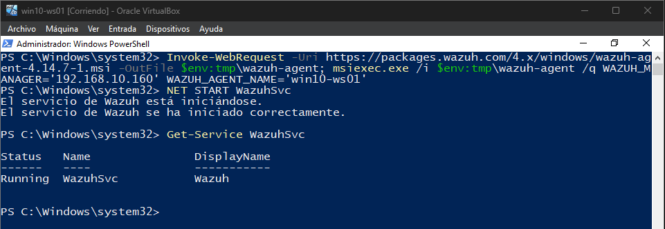

### Verificación del enrolado

Desde el servidor:

```bash
/var/ossec/bin/agent_control -l
```

```
Wazuh agent_control. List of available agents:
   ID: 000, Name: wazuh-server (server), IP: 127.0.0.1, Active/Local
   ID: 001, Name: win10-ws01, IP: any, Active
```

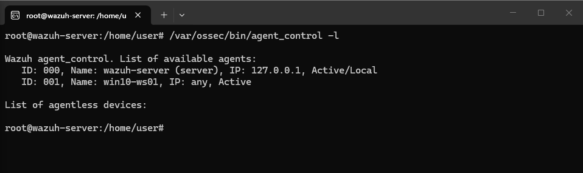

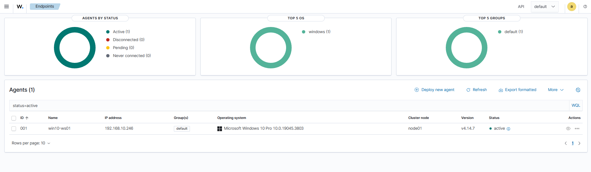

El valor `IP: any` indica que el agente se registró sin restricción de IP de origen. Es el comportamiento adecuado para un endpoint con dirección asignada por DHCP: el agente inicia siempre la conexión hacia el manager, por lo que su propia IP puede cambiar sin romper la comunicación.

---

## Caso práctico: detección de fuerza bruta

### Escenario

Se generan intentos de autenticación fallidos contra la cuenta local `user` del endpoint Windows. Cada intento produce un evento **4625** (*Error de una cuenta al iniciar sesión*) en el canal de seguridad de Windows, que el agente reenvía al manager para su análisis.

La prueba se realizó en dos fases deliberadamente distintas:

1. **Intentos manuales** desde la pantalla de bloqueo (`Win + L`), que generan eventos de **tipo 2 (interactivo)**.
2. **Ráfaga automatizada** mediante autenticación SMB contra la propia máquina, que genera eventos de **tipo 3 (red)**:

```powershell
1..8 | ForEach-Object { net use \\127.0.0.1\IPC$ /user:"$env:COMPUTERNAME\user" "MalaPass$_" 2>$null }
```

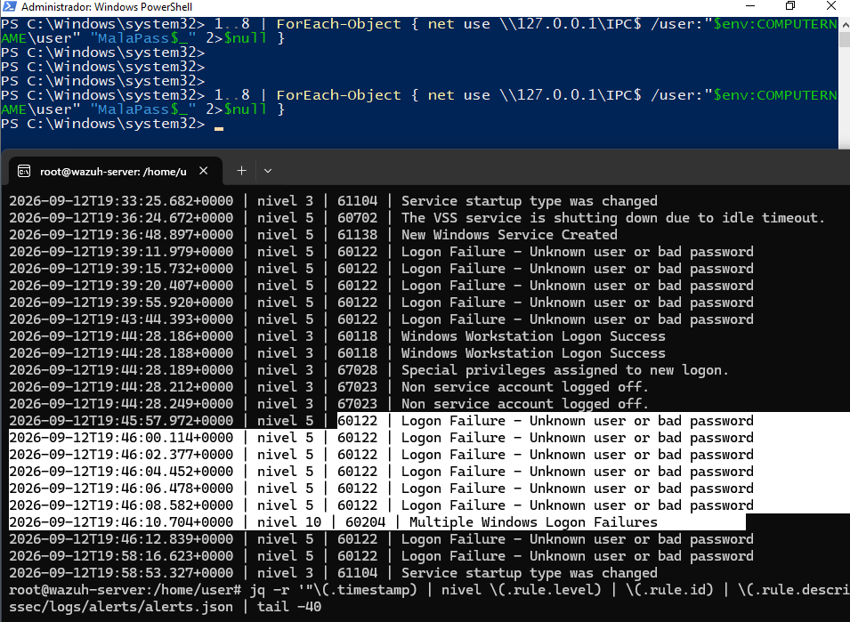

### Detección

Monitorización de alertas en tiempo real:

```bash
tail -f /var/ossec/logs/alerts/alerts.json
```

El fichero de alertas en bruto es prácticamente ilegible: cada evento ocupa decenas de líneas de JSON. Para el trabajo de análisis se usó un filtrado con `jq` que reduce cada alerta a una sola línea con los campos relevantes:

```bash
jq -r '"\(.timestamp) | nivel \(.rule.level) | \(.rule.id) | \(.rule.description)"' \
  /var/ossec/logs/alerts/alerts.json | tail -40
```

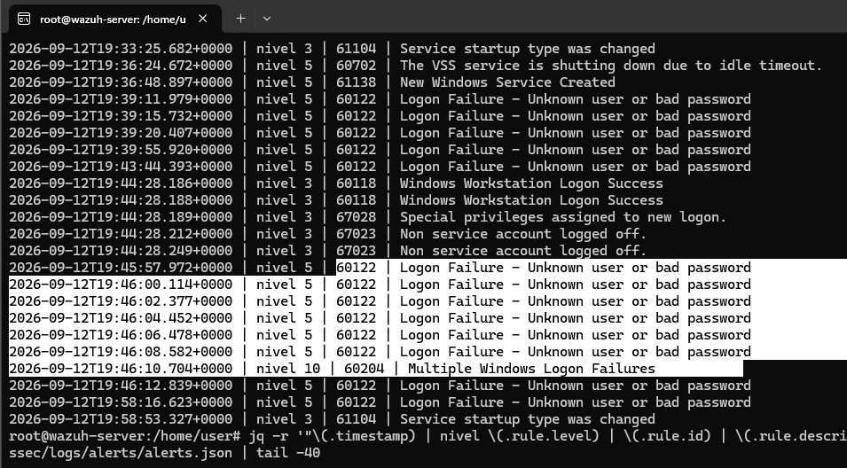

### Cronología del incidente

```
19:31:53  nivel 5   60122  Logon Failure - Unknown user or bad password   ← intentos manuales (tipo 2)
19:31:58  nivel 5   60122  Logon Failure
19:32:01  nivel 5   60122  Logon Failure
19:39:11  nivel 5   60122  Logon Failure                                  ← segunda tanda manual
19:39:15  nivel 5   60122  Logon Failure
19:39:20  nivel 5   60122  Logon Failure
19:39:55  nivel 5   60122  Logon Failure
19:43:44  nivel 5   60122  Logon Failure
19:44:28  nivel 3   60118  Windows Workstation Logon Success              ← inicio de sesión correcto
19:44:28  nivel 3   67028  Special privileges assigned to new logon
19:45:57  nivel 5   60122  Logon Failure                                  ← ráfaga automatizada (tipo 3)
19:46:00  nivel 5   60122  Logon Failure
19:46:02  nivel 5   60122  Logon Failure
19:46:04  nivel 5   60122  Logon Failure
19:46:06  nivel 5   60122  Logon Failure
19:46:08  nivel 5   60122  Logon Failure
19:46:10  nivel 10  60204  Multiple Windows Logon Failures                ← CORRELACIÓN
19:46:12  nivel 5   60122  Logon Failure
```

**Observación clave:** los intentos espaciados no dispararon ninguna alerta agregada. La regla de correlación `60204` exige una **frecuencia de 8 eventos dentro de una ventana temporal**; los intentos manuales, separados por más de 30 segundos, caducaban antes de alcanzar el umbral. Solo la ráfaga automatizada —8 eventos en 11 segundos— activó la detección.

### Evidencia

Extracto de un evento 4625 individual, recortado a los campos relevantes:

```json
{
  "timestamp": "2026-09-12T19:45:57.972+0000",
  "rule": { "level": 5, "id": "60122", "description": "Logon Failure - Unknown user or bad password" },
  "agent": { "id": "001", "name": "win10-ws01", "ip": "192.168.10.246" },
  "data": { "win": { "eventdata": {
      "targetUserName": "user",
      "targetDomainName": "DESKTOP-5TK7R4T",
      "status": "0xc000006d",
      "subStatus": "0xc000006a",
      "logonType": "3",
      "logonProcessName": "NtLmSsp",
      "authenticationPackageName": "NTLM",
      "ipAddress": "127.0.0.1",
      "ipPort": "49822"
  }}}
}
```

Alerta de correlación resultante:

```json
{
  "timestamp": "2026-09-12T19:46:10.704+0000",
  "rule": {
    "level": 10,
    "id": "60204",
    "description": "Multiple Windows Logon Failures",
    "mitre": { "id": ["T1110"], "tactic": ["Credential Access"], "technique": ["Brute Force"] },
    "frequency": 8
  },
  "agent": { "id": "001", "name": "win10-ws01", "ip": "192.168.10.246" }
}
```

El campo `previous_output` de esta alerta contiene los ocho eventos que la dispararon: es la cadena de evidencia que adjuntaría al ticket si se tratara de un incidente real.

### Análisis de los indicadores

| Indicador | Valor observado | Qué aporta al análisis |
|---|---|---|
| `logonType` | `2` y `3` | Tipo 2 = sesión interactiva (teclado físico). Tipo 3 = autenticación por red. Distinguirlos cambia por completo la hipótesis sobre el origen del ataque |
| `subStatus` | `0xC000006A` | **Usuario válido, contraseña incorrecta.** Si fuera `0xC0000064` significaría que la cuenta no existe. El atacante ya conoce un nombre de usuario real |
| `ipAddress` | `127.0.0.1` | Origen local. La autenticación llegó por SMB pero desde la propia máquina: apunta a un proceso local, no a un atacante remoto |
| `ipPort` | `49822`, `49824`, `49826`… | Puertos efímeros distintos por intento en los eventos de red. En los interactivos es siempre `0`, al no existir conexión de red |
| `authenticationPackageName` | `NTLM` / `Negotiate` | NTLM en los de red (`NtLmSsp`), Negotiate en los interactivos (`User32`) |
| Cadencia | 8 intentos en 11 s (~1,3/s) | **Ningún humano teclea a esa velocidad.** Solo el ritmo ya permite afirmar que hubo herramienta automatizada |

### Triaje de la alerta (metodología de las 5 W)

| | |
|---|---|
| **What** | 8 intentos fallidos de autenticación (Event ID 4625) contra la cuenta local `user`, que dispararon la regla 60204 *Multiple Windows Logon Failures* con severidad 10 |
| **When** | 12/09/2026, entre 19:45:57 y 19:46:08 UTC. La alerta de correlación se genera a las 19:46:10 UTC |
| **Where** | Endpoint `win10-ws01` (192.168.10.246), nombre de equipo Windows `DESKTOP-5TK7R4T` |
| **Who** | Cuenta objetivo `user`, local del equipo. Origen `127.0.0.1` — la autenticación se inició desde la propia máquina, no desde la red externa |
| **Why** | Actividad generada de forma controlada en el laboratorio para validar la capacidad de detección. En un entorno real, este patrón exigiría identificar qué proceso local originó las autenticaciones |

### Clasificación MITRE ATT&CK

| Técnica | ID | Justificación |
|---|---|---|
| Brute Force | [T1110](https://attack.mitre.org/techniques/T1110/) | Intentos repetidos y automatizados de autenticación contra una cuenta conocida, con cadencia incompatible con un usuario humano. La subtécnica más ajustada sería [T1110.001 — Password Guessing](https://attack.mitre.org/techniques/T1110/001/), al probarse contraseñas distintas contra un único usuario válido |

**Observación sobre el mapeo por defecto de Wazuh:** la regla individual `60122` viene mapeada a `T1531 — Account Access Removal` (táctica *Impact*), clasificación que no encaja con un simple fallo de contraseña: T1531 describe la eliminación o bloqueo de cuentas por parte de un adversario. Es la regla de correlación `60204` la que aplica el mapeo correcto a T1110 / *Credential Access*.

Esto ilustra un principio operativo importante: **la técnica de ataque rara vez es identificable en un evento aislado; emerge del patrón.** Un fallo de autenticación suelto es ambiguo; ocho seguidos son fuerza bruta.

### Respuesta y mitigación propuesta

Al tratarse de un laboratorio controlado, la alerta se cierra como actividad propia justificada. Si fuera un incidente real, estos serían mis siguientes pasos:

1. **Verificar si algún intento tuvo éxito**, buscando eventos 4624 de la misma cuenta inmediatamente posteriores. Es la pregunta que determina si esto es un intento fallido o una intrusión consumada.
2. **Identificar el proceso de origen**, dado que la autenticación provino de `127.0.0.1`: un ataque local implica que el adversario ya dispone de ejecución en el equipo.
3. **Revisar la política de bloqueo de cuentas.** En este caso, la auditoría CIS confirmó que **no está configurada** (controles 15506, 15507 y 15508), lo que explica que el ataque pudiera completarse sin bloqueo alguno.
4. **Escalar a L2** si se confirmara acceso exitoso o si no pudiera justificar el proceso de origen.

**Mitigaciones recomendadas:** política de bloqueo de cuentas, autenticación multifactor donde sea viable, y restricción de NTLM en favor de Kerberos en entornos de dominio.

---

## Hallazgos adicionales

Durante la investigación, el mismo conjunto de datos reveló tres hallazgos no previstos en el escenario original.

### 1. Auditoría de configuración CIS: el endpoint puntúa 25 %

Wazuh ejecutó de forma automática un **SCA (Security Configuration Assessment)** contra el endpoint, comparando su configuración con el *CIS Microsoft Windows 10 Enterprise Benchmark v4.0.0*:

```
19:04:08 | nivel 9 | 19005 | SCA summary: CIS Microsoft Windows 10 Enterprise Benchmark v4.0.0: Score less than 30% (25)
```

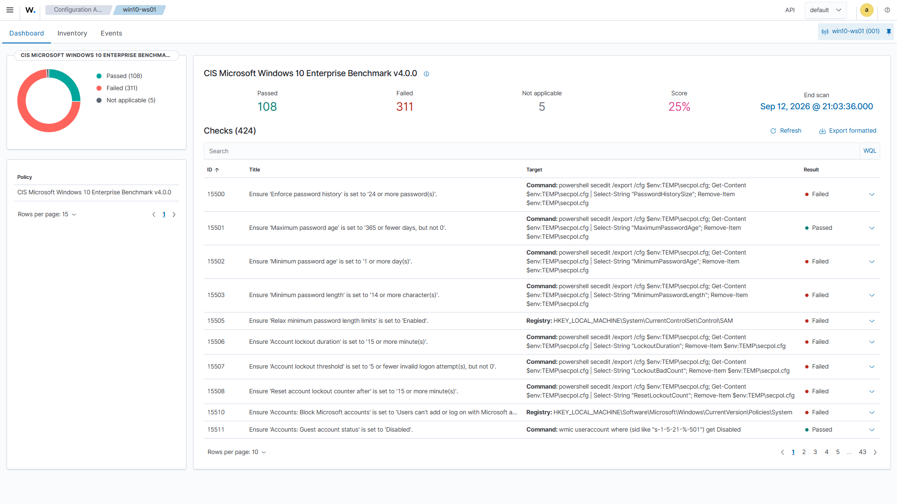

De un total de **424 controles evaluados**, el endpoint **incumple 311** y solo supera 108 (5 no aplicables), lo que sitúa la puntuación en un **25 %**.

Entre los controles fallidos hay tres directamente relevantes para el incidente analizado en este laboratorio:

| ID | Control | Resultado |
|---|---|---|
| 15506 | *Ensure 'Account lockout duration' is set to '15 or more minute(s)'* | **Failed** |
| 15507 | *Ensure 'Account lockout threshold' is set to '5 or fewer invalid logon attempt(s), but not 0'* | **Failed** |
| 15508 | *Ensure 'Reset account lockout counter after' is set to '15 or more minute(s)'* | **Failed** |

**La política de bloqueo de cuentas no está configurada en el endpoint.** Este hallazgo explica por qué el ataque de fuerza bruta documentado en el apartado anterior pudo ejecutar dieciséis intentos consecutivos sin que la cuenta `user` llegara a bloquearse en ningún momento: no existe umbral que lo impida.

La correlación entre ambos hallazgos es el resultado más relevante del laboratorio. El SIEM detectó el ataque, pero **la auditoría de configuración identificó el control ausente que lo hizo viable**. Detección y postura de seguridad son dos caras del mismo problema: sin el control preventivo, la detección llega siempre tarde.

A la misma conclusión apuntan otros controles fallidos del bloque de contraseñas: longitud mínima (15503), historial de contraseñas (15500) y antigüedad mínima (15502), todos ellos sin configurar. También falla *Turn on PowerShell Transcription*, un control de visibilidad relevante para la detección de actividad sospechosa.

Este hallazgo demuestra además una segunda capacidad de la plataforma más allá de la detección: **evaluación continua de cumplimiento y postura de seguridad**, con una métrica cuantificable que sirve de línea base para medir mejoras de hardening.

### 2. Inicio de sesión exitoso con privilegios especiales

La cronología recoge, entre dos tandas de intentos fallidos, la siguiente secuencia:

```
19:43:44  nivel 5  60122  Logon Failure
19:44:28  nivel 3  60118  Windows Workstation Logon Success
19:44:28  nivel 3  67028  Special privileges assigned to new logon
```

Un fallo de autenticación seguido, 44 segundos después, de un inicio de sesión correcto con **asignación de privilegios especiales** (Event ID 4672, cuenta con permisos administrativos). En este laboratorio corresponde a un acceso legítimo propio, pero **la firma es idéntica a la de una credencial comprometida con escalada de privilegios**, y en un entorno real justificaría escalado inmediato.

### 3. Creación de un servicio en Windows — descartado

```
19:36:48 | nivel 5 | 61138 | New Windows Service Created  (T1543.003)
```

La creación de servicios es un mecanismo habitual de persistencia, así que verifiqué el artefacto antes de descartarlo:

```
Nombre del servicio:  MpKsl8ec6c75f
Ruta:  C:\ProgramData\Microsoft\Windows Defender\Definition Updates\{...}\MpKslDrv.sys
Tipo:  controlador de modo kernel
```

Corresponde al **controlador de análisis en modo kernel de Microsoft Defender**, instalado durante una actualización de definiciones. **Falso positivo, actividad legítima del sistema.**

---

## Problemas encontrados

| Problema | Causa | Solución |
|---|---|---|
| La instalación falla en el componente *dashboard* y revierte todo el despliegue | El instalador de Ubuntu Server asignó solo 24 GB al volumen raíz LVM de un disco de 50 GB, dejando 14 GB libres — insuficientes para el stack completo | Ampliar el volumen lógico al espacio disponible: `lvextend -l +100%FREE /dev/ubuntu-vg/ubuntu-lv` y `resize2fs`. El volumen pasó de 24 GB a 48 GB |
| Reinstalación abortada con `Wazuh manager already installed` | El rollback del primer intento eliminó los ficheros de `/var/ossec` pero dejó el paquete registrado en dpkg | Relanzar con la opción `-o/--overwrite` |
| `dpkg --purge` falla con *pre-removal script subprocess returned error exit status 127*, paquete atascado en estado `pi` | Dependencia circular: el script `prerm` del paquete invoca binarios de `/var/ossec/bin` que ya habían sido eliminados. Código 127 = orden no encontrada | Neutralizar los scripts de mantenimiento sustituyéndolos por un `exit 0` en `/var/lib/dpkg/info/wazuh-manager.{prerm,postrm}` y purgar de nuevo. La instalación posterior completó sin errores |
| La VM Windows no resuelve nombres: *No se puede resolver el nombre remoto: packages.wazuh.com* | Configuración de red del adaptador virtual | Revisar el modo de red del adaptador y la configuración DNS del endpoint |
| La regla de correlación de fuerza bruta no se dispara pese a acumular múltiples fallos | Los intentos manuales estaban demasiado espaciados (>30 s) y caducaban de la ventana temporal antes de alcanzar el umbral de frecuencia | Automatizar la generación para concentrar 8 intentos en pocos segundos |

Salida real del primer despliegue fallido:

```
11/09/2026 14:36:18 INFO: --- Wazuh dashboard ---
11/09/2026 14:36:18 INFO: Starting Wazuh dashboard installation.
11/09/2026 14:36:48 ERROR: Wazuh dashboard installation failed.
11/09/2026 14:36:48 INFO: --- Removing existing Wazuh installation ---
11/09/2026 14:36:48 INFO: Removing Wazuh manager.
11/09/2026 14:36:49 INFO: Removing Wazuh indexer.
11/09/2026 14:36:54 INFO: Installation cleaned. Check the /var/log/wazuh-install.log file to learn more about the issue.
```

Y del paquete atascado en dpkg, que fue el problema más difícil de diagnosticar:

```
dpkg: error processing package wazuh-manager (--purge):
 installed wazuh-manager package pre-removal script subprocess returned error exit status 127
Errors were encountered while processing:
 wazuh-manager

pi  wazuh-manager   4.14.7-1   amd64   Wazuh manager
```

**Incidencia documentada pero no resuelta:** durante el primer despliegue se registraron bloqueos del kernel en la VM del servidor (`rcu_preempt detected stalls on CPUs/tasks`, con aviso de que *OOM is now expected behavior*). Se corresponden con la ejecución de VirtualBox sobre Hyper-V en el anfitrión, que degrada el acceso directo a la virtualización por hardware. No se modificó la configuración del sistema anfitrión, y el despliegue completó correctamente una vez resueltos los problemas de disco y de paquetería, por lo que no resultó bloqueante.

---

## Conclusiones

El laboratorio cubre un ciclo completo de operación SOC de nivel 1: despliegue de la plataforma, incorporación de un endpoint, generación controlada de actividad maliciosa, detección, triaje estructurado y propuesta de mitigación.

Más allá del despliegue, el ejercicio deja cuatro aprendizajes concretos:

- **La correlación es lo que convierte eventos en detecciones.** Ocho fallos de autenticación aislados de severidad 5 generan una única alerta de severidad 10 que sí identifica la técnica. Sin ventana temporal ni umbral de frecuencia, solo hay ruido.
- **Detectar no es lo mismo que estar protegido.** El SIEM identificó el ataque, pero la auditoría de configuración reveló que la ausencia de política de bloqueo de cuentas era precisamente lo que lo hacía viable. La detección sin control preventivo llega siempre tarde.
- **Los mapeos por defecto de una herramienta se revisan, no se asumen.** La regla individual clasificaba la actividad bajo una técnica MITRE que no correspondía al comportamiento observado.
- **Los problemas de despliegue son parte del trabajo.** Resolver un paquete atascado en dpkg por una dependencia circular en sus scripts de mantenimiento tiene tanto valor formativo como la detección en sí.

---

## Evolución del laboratorio

Este laboratorio está planteado como base sobre la que iterar. La siguiente fase se centra en cerrar la brecha que la propia investigación puso de manifiesto:

- **Configurar la política de bloqueo de cuentas** y repetir el ataque, verificando que la cuenta se bloquea antes de alcanzar el umbral de correlación. Es la validación directa del hallazgo del SCA.
- **Integrar Sysmon** en el endpoint para ampliar la visibilidad sobre creación de procesos y conexiones de red, más allá de lo que registra el canal de seguridad de Windows por defecto.
- **Desarrollar una regla de detección propia** con el mapeo MITRE corregido, en lugar de depender del conjunto de reglas por defecto.
- **Configurar Active Response** para pasar de la detección a la contención automática del origen tras N fallos de autenticación.

---

## Referencias

- [Documentación oficial de Wazuh](https://documentation.wazuh.com/current/)
- [MITRE ATT&CK — T1110 Brute Force](https://attack.mitre.org/techniques/T1110/)
- [Microsoft — Event ID 4625: Error de inicio de sesión](https://learn.microsoft.com/windows/security/threat-protection/auditing/event-4625)
- [Microsoft — Event ID 4672: Privilegios especiales asignados](https://learn.microsoft.com/windows/security/threat-protection/auditing/event-4672)
- [CIS Microsoft Windows 10 Benchmark](https://www.cisecurity.org/benchmark/microsoft_windows_desktop)
