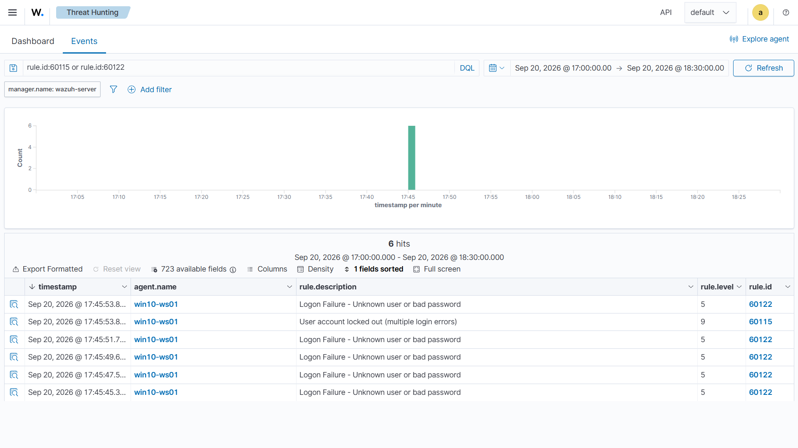
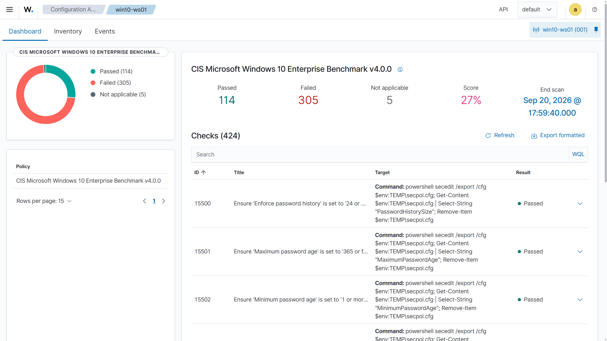

# Home SOC Lab — Despliegue de Wazuh, detección de fuerza bruta y verificación del control

> Laboratorio doméstico de operaciones de seguridad: despliegue de un SIEM real (Wazuh), monitorización de un endpoint Windows, detección y triaje de un ataque de fuerza bruta, y remediación verificada del control preventivo que lo permitió.

*Home SOC lab: Wazuh SIEM deployed on Ubuntu Server, monitoring a Windows 10 endpoint via the
Wazuh agent. Covers detection, triage and MITRE ATT&CK mapping of a brute force authentication
attack, a CIS benchmark configuration assessment, and a measured remediation phase with
before/after evidence.*

---

## Índice

- [Objetivo](#objetivo)
- [Arquitectura](#arquitectura)
- [Entorno](#entorno)
- [Despliegue del servidor Wazuh](#despliegue-del-servidor-wazuh)
- [Enrolado del agente Windows](#enrolado-del-agente-windows)
- [Caso práctico: detección de fuerza bruta](#caso-práctico-detección-de-fuerza-bruta)
- [Hallazgos adicionales](#hallazgos-adicionales)
- [Fase 2: remediación y verificación](#fase-2-remediación-y-verificación)
- [Problemas encontrados](#problemas-encontrados)
- [Conclusiones](#conclusiones)
- [Evolución del laboratorio](#evolución-del-laboratorio)
- [Referencias](#referencias)

---

## Objetivo

Montar desde cero un entorno de monitorización de seguridad equivalente al que opera un analista SOC de nivel 1, con tres metas concretas:

- Desplegar y configurar un SIEM real, no un entorno simulado ni una plataforma de formación.
- Monitorizar un endpoint Windows mediante agente y verificar la recolección de eventos.
- Generar actividad maliciosa de forma controlada, detectarla, y completar el ciclo de triaje: análisis, clasificación MITRE ATT&CK y propuesta de mitigación.

A esas tres se sumó una cuarta durante el desarrollo: **corregir el control que hizo viable el ataque y medir el efecto de la corrección sobre el mismo ataque**, que es lo que documenta la [fase 2](#fase-2-remediación-y-verificación).

---

## Arquitectura

```text
┌──────────────────────┐        agente Wazuh        ┌───────────────────────────┐
│   Endpoint Windows   │ ─────────────────────────► │      Servidor Wazuh       │
│   win10-ws01         │      puertos 1514/1515     │  Manager + Indexer +      │
│   192.168.10.246     │                            │  Dashboard (all-in-one)   │
└──────────────────────┘                            │  192.168.10.160           │
                                                    └───────────────────────────┘
                                                                  ▲
                                                                  │ HTTPS (443)
                                                        ┌─────────┴─────────┐
                                                        │  Equipo anfitrión │
                                                        │    (navegador)    │
                                                        └───────────────────┘
```

**Flujo de datos:** el agente instalado en el endpoint recoge los eventos del canal de seguridad de Windows y los envía al **manager**, que los analiza contra su conjunto de reglas y genera alertas. El **indexer** (OpenSearch) las almacena e indexa, y el **dashboard** es la interfaz donde el analista consulta e investiga.

---

## Entorno

| Componente       | Detalle                                                                                                                                                |
| ---------------- | ------------------------------------------------------------------------------------------------------------------------------------------------------ |
| Hipervisor       | VirtualBox **7.1.10 r169112**                                                                                                                          |
| VM servidor      | Ubuntu Server **24.04.5 LTS** (noble) — 8 GB RAM / 4 vCPU / disco 50 GB                                                                                |
| VM endpoint      | Windows 10 — 4 GB RAM / 2 vCPU / disco 50 GB                                                                                                           |
| Modo de red      | **Adaptador puente** — ambas VMs obtienen IP de la red local, se ven entre sí y son accesibles desde el navegador del anfitrión sin reenvío de puertos |
| Versión de Wazuh | **4.14.7** (despliegue all-in-one)                                                                                                                     |
| IP servidor      | 192.168.10.160                                                                                                                                         |
| IP endpoint      | 192.168.10.246                                                                                                                                         |

**Decisiones de diseño y su justificación:**

- **Ubuntu Server en lugar de Desktop.** El dashboard de Wazuh se consulta desde el navegador del equipo anfitrión, por lo que un entorno gráfico en la VM solo consumiría RAM y CPU sin aportar funcionalidad. Los servidores en producción se despliegan sin escritorio.
- **Versión 24.04 LTS y no la más reciente.** En el momento del despliegue, Ubuntu 26.04 LTS ya estaba disponible, pero la documentación oficial de Wazuh 4.14 solo lista soporte hasta 24.04. Se priorizó la compatibilidad soportada frente a la novedad.
- **Adaptador puente frente a NAT.** Necesitaba comunicación bidireccional entre ambas VMs y acceso al dashboard desde el anfitrión. El modo puente lo resuelve sin configurar reenvío de puertos.

---

## Despliegue del servidor Wazuh

### Instalación

Se utiliza el asistente de instalación *all-in-one*, que despliega los tres componentes centrales (manager, indexer y dashboard) en el mismo host y genera automáticamente los certificados y las credenciales de acceso:

```bash
curl -sO https://packages.wazuh.com/4.14/wazuh-install.sh
sudo bash ./wazuh-install.sh -a
```


El instalador imprime al finalizar la URL de acceso y las credenciales del usuario `admin`. Si se pierden, se recuperan desde el fichero generado durante la instalación:

```bash
sudo tar -xvf wazuh-install-files.tar
cat wazuh-install-files/wazuh-passwords.txt
```

### Verificación de servicios

```bash
systemctl status wazuh-manager wazuh-indexer wazuh-dashboard filebeat --no-pager
```


Los cuatro servicios deben aparecer como `active (running)`. El manager levanta sus daemons internos —`wazuh-analysisd`, `wazuh-remoted`, `wazuh-authd`, `wazuh-syscheckd`, `wazuh-logcollector`, `wazuh-modulesd`— y el consumo total del stack se sitúa en torno a 2,8 GB de RAM.

### Acceso al dashboard

El dashboard queda accesible en `https://192.168.10.160` desde el navegador del equipo anfitrión.

El navegador muestra una advertencia de certificado no confiable: es el comportamiento esperado, ya que el instalador genera **certificados autofirmados** en lugar de certificados emitidos por una autoridad certificadora reconocida. En un entorno de producción se sustituirían por certificados válidos emitidos por una CA de confianza.


---

## Enrolado del agente Windows

Desde el dashboard, en **Agents → Deploy new agent**, se selecciona Windows como sistema operativo, se indica la dirección IP del servidor y se asigna el nombre del agente siguiendo una convención `sistema-rol-número` (`win10-ws01`), pensada para que el nombre identifique la máquina cuando el laboratorio crezca.


El dashboard genera el comando de despliegue, que se ejecuta en PowerShell con privilegios de administrador en el endpoint:

```powershell
Invoke-WebRequest -Uri https://packages.wazuh.com/4.x/windows/wazuh-agent-4.14.7-1.msi `
  -OutFile $env:tmp\wazuh-agent
msiexec.exe /i $env:tmp\wazuh-agent /q WAZUH_MANAGER='192.168.10.160' WAZUH_AGENT_NAME='win10-ws01'
```

El parámetro `/q` ejecuta la instalación en modo silencioso: no muestra ninguna ventana ni progreso, por lo que conviene esperar unos segundos antes de comprobar el resultado.

```powershell
NET START WazuhSvc
Get-Service WazuhSvc
```


### Verificación del enrolado

Desde el servidor:

```bash
/var/ossec/bin/agent_control -l
```

```
Wazuh agent_control. List of available agents:
   ID: 000, Name: wazuh-server (server), IP: 127.0.0.1, Active/Local
   ID: 001, Name: win10-ws01, IP: any, Active
```


El valor `IP: any` indica que el agente se registró sin restricción de IP de origen. Es el comportamiento adecuado para un endpoint con dirección asignada por DHCP: el agente inicia siempre la conexión hacia el manager, por lo que su propia IP puede cambiar sin romper la comunicación.

---

## Caso práctico: detección de fuerza bruta

### Escenario

Se generan intentos de autenticación fallidos contra la cuenta local `user` del endpoint Windows. Cada intento produce un evento **4625** (*Error de una cuenta al iniciar sesión*) en el canal de seguridad de Windows, que el agente reenvía al manager para su análisis.

La prueba se realizó en dos fases deliberadamente distintas:

1. **Intentos manuales** desde la pantalla de bloqueo (`Win + L`), que generan eventos de **tipo 2 (interactivo)**.
2. **Ráfaga automatizada** mediante autenticación SMB contra la propia máquina, que genera eventos de **tipo 3 (red)**:

```powershell
1..8 | ForEach-Object { net use \\127.0.0.1\IPC$ /user:"$env:COMPUTERNAME\user" "MalaPass$_" 2>$null }
```


### Detección

Monitorización de alertas en tiempo real:

```bash
tail -f /var/ossec/logs/alerts/alerts.json
```

El fichero de alertas en bruto es prácticamente ilegible: cada evento ocupa decenas de líneas de JSON. Para el trabajo de análisis se usó un filtrado con `jq` que reduce cada alerta a una sola línea con los campos relevantes:

```bash
jq -r '"\(.data.win.system.systemTime) | nivel \(.rule.level) | \(.rule.id) | \(.rule.description)"' \
  /var/ossec/logs/alerts/alerts.json | tail -40
```


> **Sobre el campo de tiempo.** El campo `timestamp` de una alerta de Wazuh es el momento en que **el manager la procesó**, no el momento en que el evento ocurrió en el endpoint. En este laboratorio el desfase de ingesta osciló entre 15 y 45 segundos. Para reconstruir cronologías se usa `data.win.system.systemTime`, que es la hora del propio evento. **Salvo en las citas literales de log y en las capturas del dashboard, todas las horas de este documento son horas de evento en UTC.**

### Cronología del incidente

```
19:31:11  4625   Logon Failure   tipo 2   ← intentos manuales
19:31:18  4625   Logon Failure   tipo 2
19:31:22  4625   Logon Failure   tipo 2
19:39:12  4625   Logon Failure   tipo 2   ← segunda tanda manual
19:39:15  4625   Logon Failure   tipo 2
19:39:18  4625   Logon Failure   tipo 2
19:39:40  4625   Logon Failure   tipo 2
19:42:40  4625   Logon Failure   tipo 2
19:43:40  4624   Logon Success            ← inicio de sesión correcto (×2)
19:43:40  4672   Special privileges assigned to new logon
19:45:42  4625   Logon Failure   tipo 3   ← ráfaga automatizada
19:45:44  4625   Logon Failure   tipo 3
19:45:46  4625   Logon Failure   tipo 3
19:45:48  4625   Logon Failure   tipo 3
19:45:50  4625   Logon Failure   tipo 3
19:45:52  4625   Logon Failure   tipo 3
19:45:54  4625   Logon Failure   tipo 3
19:45:55  4625   Logon Failure   tipo 3   → dispara 60204, nivel 10, CORRELACIÓN
19:56:13  4625   Logon Failure   tipo 3
```

**Observación clave:** los intentos espaciados no dispararon ninguna alerta agregada. La regla de correlación `60204` exige una **frecuencia de 8 eventos dentro de una ventana temporal**, y las dos tandas manuales nunca acumularon ocho dentro de esa ventana. Solo la ráfaga automatizada —ocho eventos en trece segundos— activó la detección.

### Evidencia

Extracto de un evento 4625 individual, recortado a los campos relevantes:

```json
{
  "rule": { "level": 5, "id": "60122", "description": "Logon Failure - Unknown user or bad password" },
  "agent": { "id": "001", "name": "win10-ws01", "ip": "192.168.10.246" },
  "data": { "win": { "eventdata": {
      "targetUserName": "user",
      "targetDomainName": "DESKTOP-5TK7R4T",
      "status": "0xc000006d",
      "subStatus": "0xc000006a",
      "logonType": "3",
      "logonProcessName": "NtLmSsp",
      "authenticationPackageName": "NTLM",
      "ipAddress": "127.0.0.1",
      "ipPort": "49822"
  }}}
}
```

Alerta de correlación resultante:

```json
{
  "rule": {
    "level": 10,
    "id": "60204",
    "description": "Multiple Windows Logon Failures",
    "mitre": { "id": ["T1110"], "tactic": ["Credential Access"], "technique": ["Brute Force"] },
    "frequency": 8
  },
  "agent": { "id": "001", "name": "win10-ws01", "ip": "192.168.10.246" }
}
```

El campo `previous_output` de esta alerta contiene los ocho eventos que la dispararon: es la cadena de evidencia que adjuntaría al ticket si se tratara de un incidente real.

### Análisis de los indicadores

| Indicador | Valor observado | Qué aporta al análisis |
|---|---|---|
| `logonType` | `2` y `3` | Tipo 2 = sesión interactiva (teclado físico). Tipo 3 = autenticación por red. Distinguirlos cambia por completo la hipótesis sobre el origen del ataque |
| `subStatus` | `0xC000006A` | **Usuario válido, contraseña incorrecta.** Si fuera `0xC0000064` significaría que la cuenta no existe. El atacante ya conoce un nombre de usuario real |
| `ipAddress` | `127.0.0.1` | Origen local. La autenticación llegó por SMB pero desde la propia máquina: apunta a un proceso local, no a un atacante remoto |
| `ipPort` | `49822`, `49824`, `49826`… | Puertos efímeros distintos por intento en los eventos de red. En los interactivos es siempre `0`, al no existir conexión de red |
| `authenticationPackageName` | `NTLM` / `Negotiate` | NTLM en los de red (`NtLmSsp`), Negotiate en los interactivos (`User32`) |
| Cadencia | 8 intentos en 13 s, uno cada ~2 s exactos | **Ningún humano teclea con esa regularidad.** Los intentos manuales, en cambio, se separan por huecos irregulares de entre 3 y 470 segundos. El patrón temporal por sí solo separa humano de automatización |

### Triaje de la alerta (metodología de las 5 W)

| | |
|---|---|
| **What** | 8 intentos fallidos de autenticación (Event ID 4625) contra la cuenta local `user`, que dispararon la regla 60204 *Multiple Windows Logon Failures* con severidad 10 |
| **When** | 12/09/2026, entre 19:45:42 y 19:45:55 UTC (horas de evento) |
| **Where** | Endpoint `win10-ws01` (192.168.10.246), nombre de equipo Windows `DESKTOP-5TK7R4T` |
| **Who** | Cuenta objetivo `user`, local del equipo. Origen `127.0.0.1` — la autenticación se inició desde la propia máquina, no desde la red externa |
| **Why** | Actividad generada de forma controlada en el laboratorio para validar la capacidad de detección. En un entorno real, este patrón exigiría identificar qué proceso local originó las autenticaciones |

### Clasificación MITRE ATT&CK

| Técnica | ID | Justificación |
|---|---|---|
| Brute Force | [T1110](https://attack.mitre.org/techniques/T1110/) | Intentos repetidos y automatizados de autenticación contra una cuenta conocida, con cadencia incompatible con un usuario humano. La subtécnica más ajustada sería [T1110.001 — Password Guessing](https://attack.mitre.org/techniques/T1110/001/), al probarse contraseñas distintas contra un único usuario válido |

**Observación sobre el mapeo por defecto de Wazuh:** la regla individual `60122` viene mapeada a `T1531 — Account Access Removal` (táctica *Impact*), clasificación que no encaja con un simple fallo de contraseña: T1531 describe la eliminación o bloqueo de cuentas por parte de un adversario. Es la regla de correlación `60204` la que aplica el mapeo correcto a T1110 / *Credential Access*.

Esto ilustra un principio operativo importante: **la técnica de ataque rara vez es identificable en un evento aislado; emerge del patrón.** Un fallo de autenticación suelto es ambiguo; ocho seguidos son fuerza bruta.

### Respuesta y mitigación propuesta

Al tratarse de un laboratorio controlado, la alerta se cierra como actividad propia justificada. Si fuera un incidente real, estos serían mis siguientes pasos:

1. **Verificar si algún intento tuvo éxito**, buscando eventos 4624 de la misma cuenta inmediatamente posteriores. Es la pregunta que determina si esto es un intento fallido o una intrusión consumada.
2. **Identificar el proceso de origen**, dado que la autenticación provino de `127.0.0.1`: un ataque local implica que el adversario ya dispone de ejecución en el equipo.
3. **Revisar la política de bloqueo de cuentas.** La auditoría CIS la marcó como no conforme (controles 15506, 15507 y 15508). El porqué de que no llegara a activarse durante el ataque se analiza en la [fase 2](#fase-2-remediación-y-verificación), y no es el que parecía a primera vista.
4. **Escalar a L2** si se confirmara acceso exitoso o si no pudiera justificar el proceso de origen.

**Mitigaciones recomendadas:** política de bloqueo de cuentas conforme al benchmark, autenticación multifactor donde sea viable, y restricción de NTLM en favor de Kerberos en entornos de dominio.

---

## Hallazgos adicionales

Durante la investigación, el mismo conjunto de datos reveló tres hallazgos no previstos en el escenario original.

### 1. Auditoría de configuración CIS: el endpoint puntúa 25 %

Wazuh ejecutó de forma automática un **SCA (Security Configuration Assessment)** contra el endpoint, comparando su configuración con el *CIS Microsoft Windows 10 Enterprise Benchmark v4.0.0*:

```
19:04:08 | nivel 9 | 19005 | SCA summary: CIS Microsoft Windows 10 Enterprise Benchmark v4.0.0: Score less than 30% (25)
```


De un total de **424 controles evaluados**, el endpoint **incumple 311** y solo supera 108 (5 no aplicables), lo que sitúa la puntuación en un **25 %**.

Entre los controles fallidos hay tres directamente relevantes para el incidente analizado:

| ID | Control | Resultado |
|---|---|---|
| 15506 | *Ensure 'Account lockout duration' is set to '15 or more minute(s)'* | **Failed** |
| 15507 | *Ensure 'Account lockout threshold' is set to '5 or fewer invalid logon attempt(s), but not 0'* | **Failed** |
| 15508 | *Ensure 'Reset account lockout counter after' is set to '15 or more minute(s)'* | **Failed** |

El valor real de esos tres parámetros en el endpoint era **10 intentos, 10 minutos de bloqueo y 10 minutos de ventana**: los que Windows aplica por defecto. La política existe; lo que no cumple es el estándar, que exige un umbral de 5 o menos y tiempos de 15 minutos o más.

La distinción importa, y me costó una hipótesis equivocada darme cuenta: *no conforme* no es lo mismo que *ausente*, y la diferencia cambia por completo el análisis de por qué el ataque prosperó. El desarrollo está en la [fase 2](#fase-2-remediación-y-verificación).

A los mismos valores por defecto apuntan otros controles fallidos del bloque de contraseñas: longitud mínima (15503), historial (15500) y antigüedad mínima (15502). También falla *Turn on PowerShell Transcription*, un control de visibilidad relevante para la detección.

Este hallazgo demuestra una segunda capacidad de la plataforma más allá de la detección: **evaluación continua de cumplimiento y postura de seguridad**, con una métrica cuantificable que sirve de línea base para medir mejoras de hardening.

### 2. Inicio de sesión exitoso con privilegios especiales

La cronología recoge, entre las dos tandas de intentos fallidos, la siguiente secuencia:

```
19:42:40  4625  Logon Failure
19:43:40  4624  Logon Success
19:43:40  4672  Special privileges assigned to new logon
```

Un fallo de autenticación seguido, sesenta segundos después, de un inicio de sesión correcto con **asignación de privilegios especiales** (Event ID 4672, cuenta con permisos administrativos). En este laboratorio corresponde a un acceso legítimo propio, pero **la firma es idéntica a la de una credencial comprometida con escalada de privilegios**, y en un entorno real justificaría escalado inmediato.

Este hallazgo parecía independiente del anterior. No lo es: resultó ser la pieza que explica por qué el bloqueo de cuentas nunca se activó.

### 3. Creación de un servicio en Windows — descartado

```
19:36:48 | nivel 5 | 61138 | New Windows Service Created  (T1543.003)
```

La creación de servicios es un mecanismo habitual de persistencia, así que verifiqué el artefacto antes de descartarlo:

```
Nombre del servicio:  MpKsl8ec6c75f
Ruta:  C:\ProgramData\Microsoft\Windows Defender\Definition Updates\{...}\MpKslDrv.sys
Tipo:  controlador de modo kernel
```

Corresponde al **controlador de análisis en modo kernel de Microsoft Defender**, instalado durante una actualización de definiciones. **Falso positivo, actividad legítima del sistema.**

---

## Fase 2: remediación y verificación

El hallazgo del SCA dejaba una pregunta abierta: si la política de bloqueo existe con un umbral de 10 y el ataque acumuló diecisiete intentos fallidos, ¿por qué la cuenta `user` no se bloqueó en ningún momento?

Esta fase responde a esa pregunta, corrige la configuración y **mide el efecto de la corrección sobre el mismo ataque**.

### Punto de partida

```
Umbral de bloqueo:                                10
Duración de bloqueo (minutos):                    10
Ventana de obs. de bloqueo (minutos):             10
Longitud mínima de contraseña:                    0
Duración del historial de contraseñas:            Ninguna
Duración mín. de contraseña (días):               0
```

### Hipótesis descartadas

**Hipótesis 1: no existía política de bloqueo.** Falsa. La salida de `net accounts` la desmiente.

**Hipótesis 2: la cuenta sí se bloqueó y no lo vimos.** Es la hipótesis peligrosa, porque la conclusión original —*"no se bloqueó"*— se había deducido de no haber visto ninguna alerta, sin comprobar antes si ese evento estaba siquiera siendo auditado. Descartarla exige dos comprobaciones, en este orden:

```cmd
auditpol /get /subcategory:"{0CCE9235-69AE-11D9-BED3-505054503030}"
```

```
Administración de cuentas
  Administración de cuentas de usuario    Aciertos
```

La auditoría está activa. Conviene señalar que el evento **4740** se registra bajo *Administración de cuentas de usuario*, **no** bajo la subcategoría llamada *Bloqueo de cuenta* de Inicio/cierre de sesión, que es la que el nombre sugiere. Se consultan por GUID porque los nombres cambian con el idioma del sistema.

Con la auditoría confirmada, la ausencia de eventos sí significa algo:

```powershell
Get-WinEvent -FilterHashtable @{LogName='Security'; Id=4740}
Get-WinEvent : No se encontraron eventos que coincidan con los criterios de selección especificados
```

Y los diecisiete eventos 4625 del incidente tienen todos `subStatus: 0xc000006a` (contraseña incorrecta); ninguno `0xc0000234` (cuenta bloqueada). **La cuenta nunca se bloqueó, y ahora está verificado en lugar de supuesto.**

### La causa: un inicio de sesión correcto reinicia el contador

| Tramo | Eventos | `badPwdCount` |
|---|---|---|
| 19:31:11 → 19:42:40 | 8 × 4625 (tipo 2) | llega a **8** |
| **19:43:40** | **4624 — inicio de sesión correcto** | **reset a 0** |
| 19:45:42 → 19:45:55 | 8 × 4625 (tipo 3) | llega a **8** |
| 19:56:13 | 1 × 4625 | han pasado 10 min 18 s desde el anterior: la ventana de observación caduca y el contador vuelve a cero |

**Un inicio de sesión correcto pone `badPwdCount` a cero.** El acceso legítimo de las 19:43:40 —el mismo que el apartado anterior documenta como hallazgo aparentemente independiente— partió el ataque en dos mitades de ocho intentos cada una. El contador nunca superó **8**, con el umbral situado en **10**.

Los dos hallazgos no eran dos: el inicio de sesión correcto en mitad del ataque es lo que impidió que el control preventivo llegara a actuar. En un ataque real el mecanismo es idéntico, y es la razón por la que los umbrales altos son peligrosos: **quien consigue autenticarse una sola vez en mitad de un *password spraying* se recarga el presupuesto entero de intentos.**

### Verificación con experimento controlado

Antes de cambiar nada, comprobé que la política funcionaba lanzando doce intentos seguidos y leyendo el contador en cada iteración:

```powershell
1..12 | ForEach-Object {
  net use \\127.0.0.1\IPC$ /user:"$env:COMPUTERNAME\user" "MalaPass$_" 2>$null | Out-Null
  $u = [ADSI]"WinNT://./user,user"
  "intento $_ -> badPwdCount = $($u.BadPasswordAttempts)"
}
```

```
intento  9 -> badPwdCount = 9
intento 10 -> badPwdCount = 10
intento 11 -> badPwdCount = 10
intento 12 -> badPwdCount = 10
```

El contador se congela en 10 y se genera el evento 4740. La política funcionaba correctamente: **lo que falló el 12/09 no fue el control, sino que el ataque nunca llegó a alcanzarlo.**

### Remediación

Seis controles CIS corregidos:

```cmd
net accounts /lockoutthreshold:5
net accounts /lockoutduration:15
net accounts /lockoutwindow:15
net accounts /minpwlen:14
net accounts /uniquepw:24
net accounts /minpwage:1
```

```
Umbral de bloqueo:                                5
Duración de bloqueo (minutos):                    15
Ventana de obs. de bloqueo (minutos):             15
Longitud mínima de contraseña:                    14
Duración del historial de contraseñas:            24
Duración mín. de contraseña (días):               1
```

### Mismo ataque, umbral conforme

Se repitió la ráfaga automatizada de ocho intentos, idéntica a la del 12/09:

```
intento 1 -> badPwdCount = 1 | bloqueada = False
intento 2 -> badPwdCount = 2 | bloqueada = False
intento 3 -> badPwdCount = 3 | bloqueada = False
intento 4 -> badPwdCount = 4 | bloqueada = False
intento 5 -> badPwdCount = 5 | bloqueada = True
intento 6 -> badPwdCount = 5 | bloqueada = True
intento 7 -> badPwdCount = 5 | bloqueada = True
intento 8 -> badPwdCount = 5 | bloqueada = True
```

Y lo que llegó al SIEM:



> La captura muestra las horas tal y como las presenta el dashboard: hora **local** (UTC+2) y campo `timestamp`, es decir, momento de ingesta. Los valores del bloque siguiente son horas de evento en UTC, tomadas de `systemTime`. Entre unas y otras hay unos cuarenta segundos de desfase de ingesta.

```
15:45:05.1459  4625  60122  nivel 5
15:45:07.5397  4625  60122  nivel 5
15:45:09.8990  4625  60122  nivel 5
15:45:12.2558  4625  60122  nivel 5
15:45:14.7999  4740  60115  nivel 9   ← User account locked out
15:45:14.8000  4625  60122  nivel 5
```

| | 12/09 — umbral 10 | 20/09 — umbral 5 |
|---|---|---|
| Intentos lanzados | 8 | 8 |
| Eventos 4625 recibidos por el SIEM | 8 | **5** |
| `badPwdCount` máximo alcanzado | 8 | 5 |
| Cuenta bloqueada | **No** | **Sí, en el quinto intento** |
| Evento 4740 | No | Sí — regla 60115, nivel 9 |
| Correlación 60204 (nivel 10) | **Sí** | **No** |
| Intentos sin telemetría | 0 | **3** |

### Hallazgo principal: endurecer el endpoint apagó la alerta

Comparando las horas de las dos pruebas realizadas el mismo día, la primera con el umbral aún en 10 y la segunda ya con 5:

```
14:55:06  60204  nivel 10   detección   (umbral 10)
14:55:10  60115  nivel  9   bloqueo, 4 s después
15:45:14  60115  nivel  9   bloqueo     (umbral 5)
                            60204 no aparece
```

Con el umbral en 10 la regla de correlación salta al octavo fallo y el bloqueo llega al décimo: **detección primero, prevención después**. El analista recibe una alerta de nivel 10 que nombra explícitamente el ataque y lo mapea a T1110.

Con el umbral en 5 el bloqueo corta en el quinto intento. Solo cinco eventos alcanzan el SIEM, y la regla 60204 exige ocho dentro de su ventana: **nunca llega a dispararse.**

Al llevar el control preventivo a conformidad CIS, **la señal de detección más explícita que existía desapareció.** Sigue habiendo cobertura —el 60115 de nivel 9 sí salta— pero la regla que identifica el ataque por su nombre y aplica el mapeo MITRE correcto ya no se activa. Si el playbook de un SOC se apoyara en la 60204, después de endurecer el parque esa regla sería código muerto.

**Conclusión de ingeniería de detección:** el umbral de frecuencia de la regla de correlación debe quedar **por debajo** del umbral de bloqueo del endpoint. Con bloqueo a 5 intentos, la correlación tiene que disparar a 3 o 4, no a 8. De lo contrario prevención y detección se estorban en lugar de complementarse.

### La regla del bloqueo y su doble mapeo

```
60115 | nivel 9 | User account locked out (multiple login errors) | T1110, T1531
```

El doble mapeo no es un error del conjunto de reglas: es una ambigüedad real del evento. Un 4740 aislado no distingue entre un bloqueo **colateral** de un ataque de fuerza bruta (T1110, *Credential Access*) y un bloqueo **deliberado** para denegar el acceso a los usuarios (T1531, *Impact*). Lo resuelve el contexto: si viene precedido de un patrón de adivinación de contraseñas, es lo primero; si se bloquean decenas de cuentas sin fallos previos que lo justifiquen, es lo segundo. Esa desambiguación es trabajo del analista, no de la herramienta.

Detalle discutible: el bloqueo puntúa **nivel 9**, por debajo del nivel 10 de la correlación de fallos, cuando el bloqueo es un impacto confirmado y la correlación solo una sospecha.

### Punto ciego: el atacante desaparece tras el bloqueo

De los ocho intentos lanzados solo cinco generaron evento. Los intentos 6, 7 y 8 **no existen en ningún registro** — ni en Wazuh ni en el visor de eventos de Windows. El mismo comportamiento se observó en la prueba de doce intentos: diez eventos registrados, los dos últimos sin rastro.

Una vez bloqueada la cuenta, Windows rechaza la autenticación **antes** de evaluar la contraseña, y no emite 4625. Dos detalles adicionales, verificados en las dos pruebas: el **4740 se emite antes que el 4625 que lo provoca** —0,14 ms en una prueba, 14,6 ms en la otra—, y ese último 4625 sigue llevando `subStatus 0xc000006a`. El subestado `0xc0000234` (cuenta bloqueada) **nunca llega a aparecer** en ningún evento.

La implicación operativa: tras activarse el bloqueo, el atacante puede seguir intentándolo indefinidamente sin generar un solo evento. **El control preventivo protege y ciega al mismo tiempo.** Un SOC que mida la intensidad de un ataque por volumen de eventos la subestimará sistemáticamente en los endpoints endurecidos.

### Ruido recurrente: candidato a tuning

Durante la fase 2 se registraron **nueve alertas `61104 Service startup type was changed` en veintiséis minutos**:

```
BITS              inicio automático ↔ inicio por solicitud
TrustedInstaller  inicio por solicitud → inicio automático
```

Es la maquinaria de Windows Update: BITS alterna su tipo de arranque según encola y termina descargas, y TrustedInstaller hace lo propio durante el servicing. Falso positivo legítimo, pero **recurrente e indefinido**, y por tanto candidato claro a supresión o rebaja de nivel. Ensucia la cronología de forma continua sin aportar valor de seguridad, que es la definición práctica de la fatiga de alertas.

### Efecto sobre la puntuación CIS



```
Passed: 114   Failed: 305   Not applicable: 5   Score: 27 %
```

Los seis controles pasaron de *Failed* a *Passed*, y la puntuación subió del **25 % al 27 %**. Los números cuadran exactamente —de 108 a 114 controles superados sobre 419 evaluables— lo que confirma que la variación es atribuible solo a la remediación y no a ruido de medición.

Dos puntos porcentuales por arreglar precisamente los controles que causaban el incidente. Es un resultado modesto y conviene decirlo tal cual: **el hardening es incremental y la puntuación CIS es una línea base, no un objetivo.** Quedan 305 controles incumplidos.

---

## Problemas encontrados

| Problema | Causa | Solución |
|---|---|---|
| La instalación falla en el componente *dashboard* y revierte todo el despliegue | El instalador de Ubuntu Server asignó solo 24 GB al volumen raíz LVM de un disco de 50 GB, dejando 14 GB libres — insuficientes para el stack completo | Ampliar el volumen lógico al espacio disponible: `lvextend -l +100%FREE /dev/ubuntu-vg/ubuntu-lv` y `resize2fs`. El volumen pasó de 24 GB a 48 GB |
| Reinstalación abortada con `Wazuh manager already installed` | El rollback del primer intento eliminó los ficheros de `/var/ossec` pero dejó el paquete registrado en dpkg | Relanzar con la opción `-o/--overwrite` |
| `dpkg --purge` falla con *pre-removal script subprocess returned error exit status 127*, paquete atascado en estado `pi` | Dependencia circular: el script `prerm` del paquete invoca binarios de `/var/ossec/bin` que ya habían sido eliminados. Código 127 = orden no encontrada | Neutralizar los scripts de mantenimiento sustituyéndolos por un `exit 0` en `/var/lib/dpkg/info/wazuh-manager.{prerm,postrm}` y purgar de nuevo. La instalación posterior completó sin errores |
| La VM Windows no resuelve nombres: *No se puede resolver el nombre remoto: packages.wazuh.com* | Configuración de red del adaptador virtual | Revisar el modo de red del adaptador y la configuración DNS del endpoint |
| La regla de correlación de fuerza bruta no se dispara pese a acumular múltiples fallos | Los intentos manuales estaban demasiado espaciados y caducaban de la ventana temporal antes de alcanzar el umbral de frecuencia | Automatizar la generación para concentrar 8 intentos en pocos segundos |
| `net accounts /lockoutwindow:15` devuelve *Error de sistema 87 — El parámetro no es correcto* | La ventana de observación no puede ser mayor que la duración del bloqueo, que en ese momento seguía en 10 minutos | Aplicar los parámetros en orden: umbral, después duración, después ventana |
| Las alertas del incidente no aparecen al consultar `alerts.json` días después | Wazuh rota el fichero cada noche a `/var/ossec/logs/alerts/AÑO/MES/`; `alerts.json` solo contiene el día en curso | Consultar los ficheros rotados. En este despliegue no están comprimidos, por lo que `cat` basta y `zcat` falla en silencio |

Salida real del primer despliegue fallido:

```
11/09/2026 14:36:18 INFO: --- Wazuh dashboard ---
11/09/2026 14:36:18 INFO: Starting Wazuh dashboard installation.
11/09/2026 14:36:48 ERROR: Wazuh dashboard installation failed.
11/09/2026 14:36:48 INFO: --- Removing existing Wazuh installation ---
11/09/2026 14:36:48 INFO: Removing Wazuh manager.
11/09/2026 14:36:49 INFO: Removing Wazuh indexer.
11/09/2026 14:36:54 INFO: Installation cleaned. Check the /var/log/wazuh-install.log file to learn more about the issue.
```

Y del paquete atascado en dpkg, que fue el problema más difícil de diagnosticar:

```
dpkg: error processing package wazuh-manager (--purge):
 installed wazuh-manager package pre-removal script subprocess returned error exit status 127
Errors were encountered while processing:
 wazuh-manager

pi  wazuh-manager   4.14.7-1   amd64   Wazuh manager
```

**Incidencia documentada pero no resuelta:** durante el primer despliegue se registraron bloqueos del kernel en la VM del servidor (`rcu_preempt detected stalls on CPUs/tasks`, con aviso de que *OOM is now expected behavior*). La hipótesis más probable es la ejecución de VirtualBox sobre un anfitrión con Hyper-V activo, que degrada el acceso directo a la virtualización por hardware, pero **no llegué a verificarla**: no se modificó la configuración del anfitrión y el despliegue completó correctamente una vez resueltos los problemas de disco y de paquetería, por lo que no resultó bloqueante. Queda anotada como hipótesis, no como causa confirmada.

---

## Conclusiones

El laboratorio cubre un ciclo completo de operación SOC de nivel 1: despliegue de la plataforma, incorporación de un endpoint, generación controlada de actividad maliciosa, detección, triaje estructurado, remediación del control deficiente y verificación medida del resultado.

Los aprendizajes que me llevo, por orden de lo que más me costó:

- **Una conclusión sin evidencia es una suposición, aunque acierte.** La primera versión de este informe afirmaba que el endpoint no tenía política de bloqueo y que por eso la cuenta nunca se bloqueó. Lo segundo era cierto; lo primero, falso; y ninguna de las dos cosas estaba verificada. **No ver una alerta no significa que no ocurriera: significa que no se estaba mirando.** Antes de concluir que un evento no se produjo hay que comprobar que ese evento estaba siendo auditado.
- **Prevención y detección no se suman automáticamente: pueden estorbarse.** Endurecer el control de bloqueo eliminó la alerta de correlación de mayor severidad que el SIEM generaba para este ataque. La conclusión operativa es que el umbral de la regla debe quedar por debajo del umbral del control, y que tras cualquier campaña de hardening hay que revisar qué detecciones han dejado de dispararse.
- **La correlación es lo que convierte eventos en detecciones.** Ocho fallos aislados de severidad 5 producen una única alerta de severidad 10 que sí identifica la técnica. Sin ventana temporal ni umbral de frecuencia, solo hay ruido.
- **Los mapeos por defecto se revisan, no se asumen.** La regla individual clasificaba la actividad bajo una técnica MITRE que no correspondía al comportamiento observado, y la regla de bloqueo arrastra dos técnicas contradictorias que solo el contexto puede desambiguar.
- **La hora del evento no es la hora de la alerta.** Reconstruir una cronología con el `timestamp` de ingesta en lugar del `systemTime` del evento introduce desfases de hasta cuarenta segundos, suficientes para invertir el orden de dos hechos y romper un razonamiento entero.
- **Los problemas de despliegue son parte del trabajo.** Resolver un paquete atascado en dpkg por una dependencia circular en sus scripts de mantenimiento tiene tanto valor formativo como la detección en sí.

---

## Evolución del laboratorio

Este laboratorio está planteado como base sobre la que iterar. Las siguientes líneas salen directamente de lo que la fase 2 dejó abierto:

- **Escribir una regla de correlación propia** con umbral de frecuencia por debajo del umbral de bloqueo (3 o 4 fallos), mapeo MITRE corregido, y validar que se dispara donde la 60204 ya no llega.
- **Suprimir o rebajar la regla 61104** para el caso de BITS y TrustedInstaller, midiendo la reducción de ruido en la cronología.
- **Integrar Sysmon** en el endpoint para ampliar la visibilidad sobre creación de procesos y conexiones de red, más allá de lo que registra el canal de seguridad de Windows por defecto.
- **Configurar Active Response** para pasar de la detección a la contención automática del origen tras N fallos de autenticación.
- **Continuar la remediación CIS** por bloques, midiendo la puntuación tras cada uno, para construir una curva de hardening en lugar de un dato aislado.

---

## Referencias

- [Documentación oficial de Wazuh](https://documentation.wazuh.com/current/)
- [MITRE ATT&CK — T1110 Brute Force](https://attack.mitre.org/techniques/T1110/)
- [MITRE ATT&CK — T1531 Account Access Removal](https://attack.mitre.org/techniques/T1531/)
- [Microsoft — Event ID 4625: Error de inicio de sesión](https://learn.microsoft.com/windows/security/threat-protection/auditing/event-4625)
- [Microsoft — Event ID 4672: Privilegios especiales asignados](https://learn.microsoft.com/windows/security/threat-protection/auditing/event-4672)
- [Microsoft — Event ID 4740: Cuenta de usuario bloqueada](https://learn.microsoft.com/windows/security/threat-protection/auditing/event-4740)
- [CIS Microsoft Windows 10 Benchmark](https://www.cisecurity.org/benchmark/microsoft_windows_desktop)
